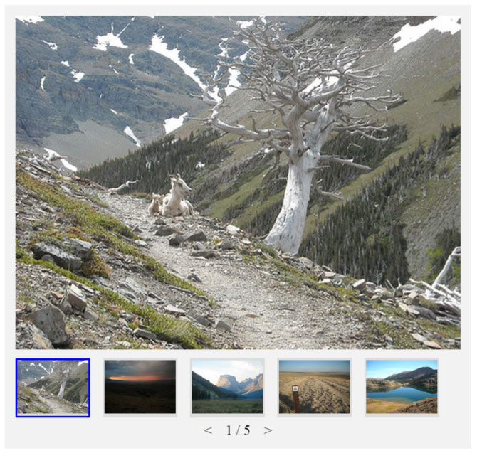

# Picture Carousel
**Due Date: 2/15/2019**

## Objective ##
Create a class which extends the class from the
[csc-adv-int-basic-gallery](https://github.com/ChadKillingsworth/csc-515-basic-gallery) module installed from npm.
Your class should add the functionality of having thumbnails below the full image as well as a counter which shows the selected image and the total number of images.
See example:


## Specifications ##
The basic gallery by default only allows swiping the images left or right on a touchscreen (you can emmulate a touchscreen in the Chrome dev tools by selecting an iPad).
While the class defines and implements `next`, `prev` and a `slide` method to change slides, the only events that are wired to those functions are the touch events.
However they do provide implementation points to work from. You will be using inheritance to accomplish this.

Write your JavaScript code in a separate file called `thumbnailgallery.js`. 
You can change the [index.html](src/index.html) markup file and [index.js](src/js/index.jx) entry point as needed - you will want to import your `thumbnailgallery.js` script as a module.

To support more thumbnail images than can fit below the main image, use the css `overflow:scroll` to enable horizontal scrolling.

## Local Development
Use webpack and the webpack-dev-server to create a local web environment.
Wireup a "start" script in the package.json file so that `npm start` automatically
starts the webpack dev server.

```js
npm install
npm start
```
